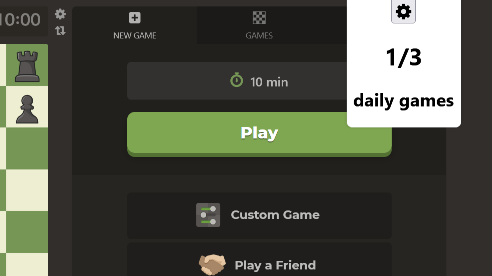
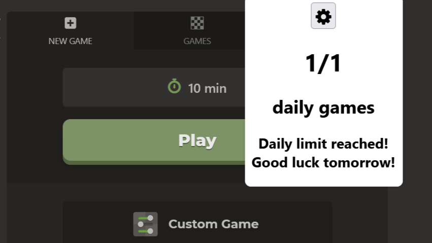
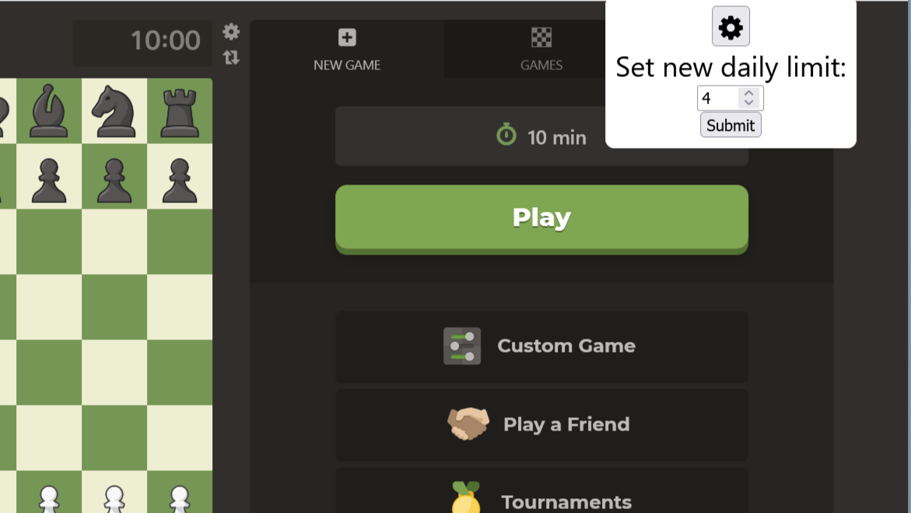

# Daily chess limit extension
This small browser extension allows to set a limit for your daily games at www.chess.com. After the limit is exceeded, the buttons for starting a new game are disabled.\
The extension is meant for people who often encounter tilt from losing games (just like me or people in [this forum thread](https://www.chess.com/forum/view/general/limit-on-daily-number-of-games)).\
Available for Mozilla Firefox ([link to extension site](https://addons.mozilla.org/cs/firefox/addon/chess-com-limit/)) but could be added also for Google Chrome.
### Screenshots
<figure>
  
  <figcaption>The number of games you played today can be seen in the popup window.</figcaption>
</figure>
<figure>
  
  <figcaption>When you reach your daily limit, the button gets disabled.</figcaption>
</figure>
<figure>
  
  <figcaption>You can always set a new daily limit.</figcaption>
</figure>

### Credits
Extension icon from icon-library.com ([Chess Icon #99673](https://icon-library.com/icon/chess-icon-20.html)).\
Settings icon from [Font Awesome](https://fontawesome.com/).
